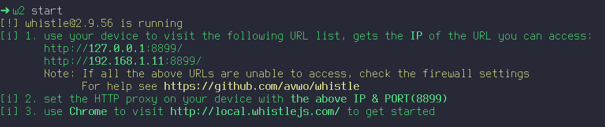
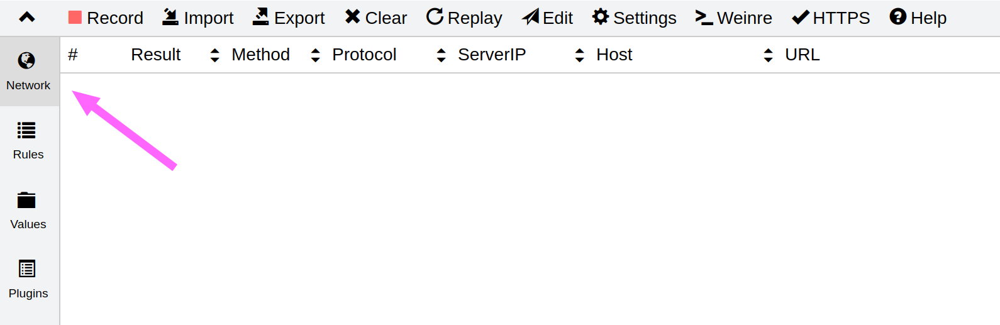
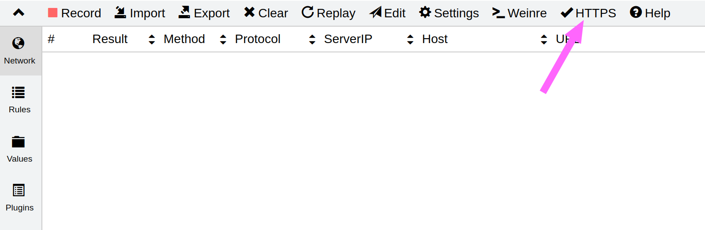
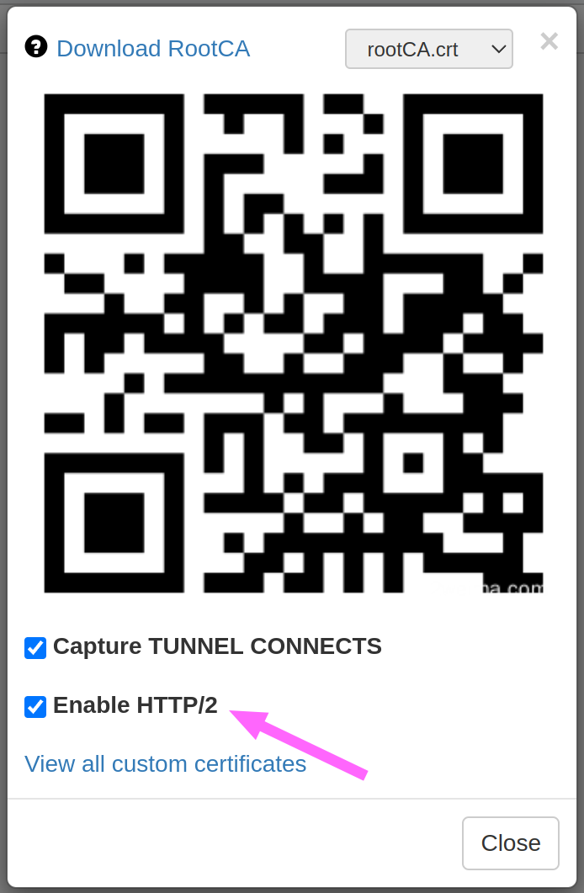
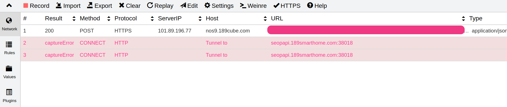
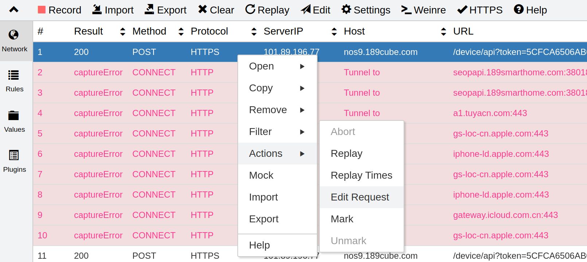
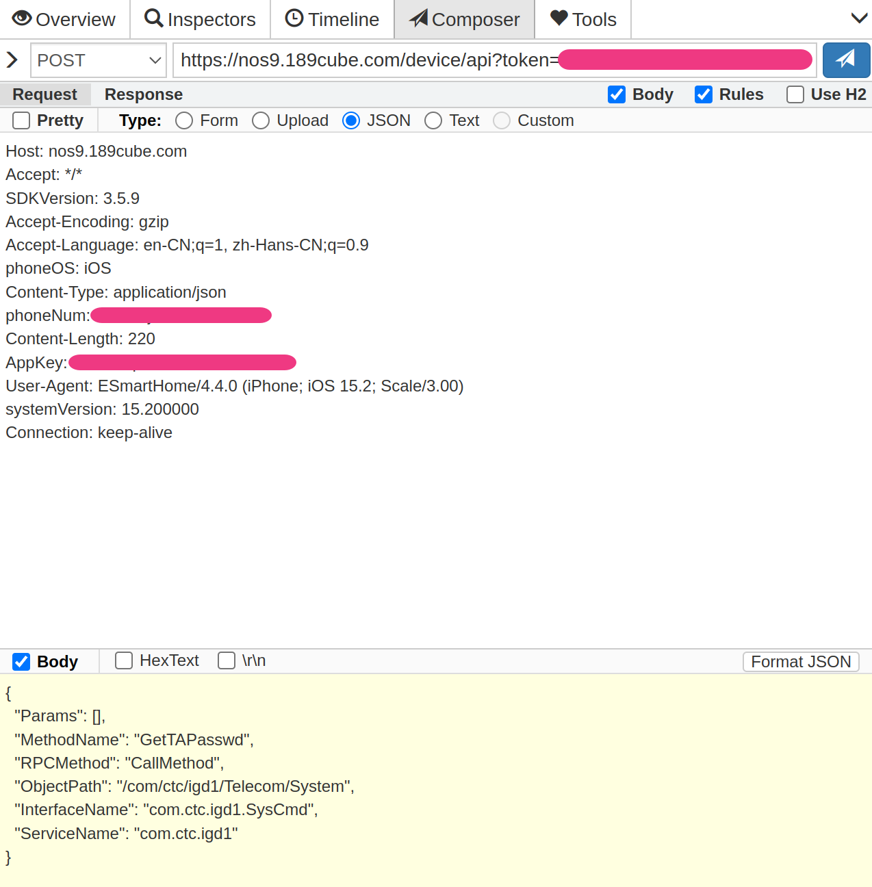
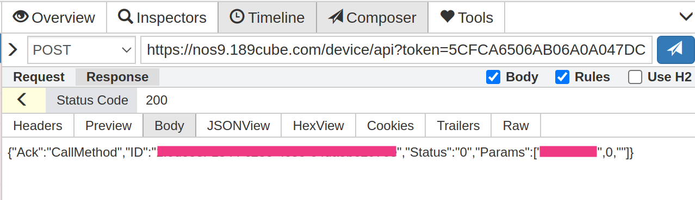

## 准备

- 抓包工具 - whistle
- 小翼管家手机 app

## 原理

利用小翼管家的远程控制路由器的功能，通过开关网关上设置进行触发网络请求，该请求会发送到小翼管家的内部的服务器，然后服务器进行对应的设备的指令的下发。

主要是获取该接口相关的请求中的认证信息，具体是什么认证信息我们不用追究。只需要篡改其请求的请求参数，将参数改为获取光猫的超级密码即可。

请求参数:

```json
{
  "Params": [],
  "MethodName": "GetTAPasswd",
  "RPCMethod": "CallMethod",
  "ObjectPath": "/com/ctc/igd1/Telecom/System",
  "InterfaceName": "com.ctc.igd1.SysCmd",
  "ServiceName": "com.ctc.igd1"
}
```

## 过程

由于 `whistle` 是一个 `npm` 的包， 所以请提前准备 `npm` 环境。
通过 `npm install -g whistle` 进行安装，安装完毕后使用 `w2 start` 进行启动。



接下来我们可以通过其中返回的地址在浏览器进行访问，可见如下界面:



首先配置 `https` 的启用，否则到时候抓到的连接的数据里面没有办法查看请求参数，也就没有办法进行篡改。







### 手机网络设置

将手机连入与电脑同一网络的局域网中，然后打开网络设置，找到代理设置。这里以 `iPhone` 进行举例：


graph TB;
A[WiFi] --> B[已连接电脑热点的详情]
B --> C[ HTTP 代理 ]
C --> D[ 手动 ]
D --> E[ 服务器 填写电脑的局域网 IP 地址 ]
E --> F[ 端口 填写 whistle 所提供的端口 8899 ]


默认情况下 `whistle` 是已经在进行数据的监听，如果未进行监听数据则可以打开 `Network` 下的 `Record` 开关，使其打开监听，如果太多杂乱的数据可以先进行点击 `Clear` 进行清除。

设置完成过后就可以打开手机上的小翼管家, 进行触发接口调用的操作

确保能够正确进入到网关的设置界面，先断开 WiFi 使用移动流量进行访问， 然后找到自己的网关详情，点击网关设置按钮进入设置页面。

这时候我们连接我们的 WiFi ，等待 WiFi 成功连接后，点击指示灯的切换。

就可以在 `whistle` 中查看到捕获到的接口请求数据:



其中 `Host` 为 `nos9.189.cube.com` 则是我们想要的接口请求。

### 重发请求

首先我们进行编辑该请求，将其中的 body 参数改为本文提供的参数



将 body 参数进行如下替换后，点击右上角的蓝色纸飞机按钮进行发送请求。



其中在 `Response` 中的 `Body` 中的内容则包含你的网关的超级密码，不同地区可能有些许不同。
成都地区的密码在 `Params` 字段的 数组的第一个字符串。



## 总结

成功获取密码后则可以通过 `网关地址:8080`进行访问管理页面，输入帐号`telecomadmin`，使用上面获取到的密码即可登录。

`whistle` 是一个非常棒的库，对于`IOS`端的抓包非常方便，并且该软件是免费且跨平台的，只要有`node`环境的都可以使用。



- [电信光猫抓包获取超级密码](https://blog.wenfxl.com/w-f-x-l-20221022-ty-centos-7x.html)


