作者： 

*一份如何编写 WebGPU 应用程序的概述， 学习 WebGPU 在绘制中所需的关键数据结构和类型。*


<iframe height="480" style="width: 100%;" scrolling="no" title="Raw WebGPU" src="https://codepen.io/alaingalvan/embed/preview/GRgvLGw?height=480&amp;theme-id=default&amp;default-tab=result" frameborder="no" allowtransparency="true" allowfullscreen="true">
  See the Pen <a href='https://codepen.io/alaingalvan/pen/GRgvLGw"'>Raw WebGPU</a> by Alain Galvan
  (<a href='https://codepen.io/alaingalvan"'>@alaingalvan</a>) on <a href='https://codepen.io"'>CodePen</a>.
</iframe>



[Github Repo](https://github.com/alaingalvan/webgpu-seed) |
[Codepen](https://codepen.io/alaingalvan/pen/GRgvLGw)



<svg width="100%" height="100%" viewBox="0 0 932 315" version="1.1" xmlns="http://www.w3.org/2000/svg" xmlns:xlink="http://www.w3.org/1999/xlink" xml:space="preserve" xmlns:serif="http://www.serif.com/" style="fill-rule:evenodd;clip-rule:evenodd;stroke-linejoin:round;stroke-miterlimit:2;">
    <path id="Triangle_1" d="M154.8,220.055L56.4,49.619L253.2,49.619L154.8,220.055Z" style="fill:#005a9c;fill-rule:nonzero;"/>
    <path id="Triangle_2" d="M252.3,49.619L203.048,134.633L301.548,134.633L252.3,49.619Z" style="fill:#0066b0;fill-rule:nonzero;"/>
    <path id="Triangle_3" d="M252.3,219.646L203.048,134.633L301.548,134.633L252.3,219.646Z" style="fill:#0076cc;fill-rule:nonzero;"/>
    <path id="Triangle_4" d="M301.349,135.041L276.621,92.535L326.077,92.535L301.349,135.041Z" style="fill:#0086e8;fill-rule:nonzero;"/>
    <path id="Triangle_5" d="M301.349,50.028L276.621,92.535L326.077,92.535L301.349,50.028Z" style="fill:#0093ff;fill-rule:nonzero;"/>
    <path id="ebGPU" d="M397.927,170C398.055,162.128 396.176,154.351 392.468,147.406C388.885,140.802 383.494,135.354 376.929,131.7C369.836,127.799 361.841,125.829 353.747,125.989C345.455,125.825 337.262,127.825 329.977,131.789C323.126,135.616 317.548,141.37 313.935,148.336C310.126,155.504 308.222,163.847 308.223,173.365C308.224,182.883 310.184,191.254 314.103,198.479C317.805,205.479 323.43,211.279 330.313,215.193C337.469,219.183 345.555,221.211 353.747,221.073C364.721,221.073 373.904,218.301 381.297,212.758C388.528,207.448 393.742,199.833 396.079,191.172L379.617,191.172C377.927,196.187 374.655,200.521 370.294,203.519C365.868,206.6 360.352,208.139 353.747,208.138C346.165,208.317 338.796,205.58 333.169,200.495C327.513,195.4 324.405,188.317 323.846,179.245L397.423,179.245C397.748,176.176 397.915,173.092 397.923,170.006L397.927,170ZM382.138,166.808L324.014,166.808C324.796,158.075 327.904,151.243 333.337,146.314C338.719,141.406 345.793,138.757 353.075,138.923C358.163,138.858 363.196,139.979 367.775,142.198C372.122,144.314 375.769,147.639 378.275,151.773C380.943,156.324 382.282,161.534 382.138,166.808ZM433.371,144.634L433.371,95.246L418.084,95.246L418.084,219.554L433.371,219.554L433.371,202.588C436.589,208.157 441.265,212.746 446.894,215.858C453.275,219.43 460.497,221.229 467.808,221.066C483.797,221.286 498.571,212.329 505.772,198.052C509.677,190.356 511.639,181.819 511.484,173.19C511.484,163.783 509.58,155.524 505.772,148.413C502.202,141.555 496.792,135.824 490.15,131.866C483.38,127.904 475.652,125.87 467.808,125.987C460.581,125.86 453.449,127.657 447.146,131.194C441.425,134.346 436.664,138.991 433.371,144.633L433.371,144.634ZM495.861,173.191C496.017,179.578 494.573,185.904 491.661,191.591C489.088,196.56 485.155,200.697 480.323,203.518C475.548,206.266 470.125,207.687 464.616,207.633C459.162,207.673 453.796,206.252 449.077,203.518C444.232,200.686 440.274,196.554 437.655,191.591C431.947,180.179 431.947,166.718 437.655,155.306C440.275,150.343 444.232,146.211 449.077,143.379C453.797,140.646 459.162,139.225 464.616,139.264C470.114,139.209 475.531,140.599 480.323,143.295C485.147,146.052 489.082,150.133 491.661,155.054C494.566,160.651 496.011,166.892 495.861,173.196L495.861,173.191ZM638.647,136.4C634.672,125.691 627.332,116.553 617.733,110.362C608.158,104.205 597.155,101.125 584.724,101.123C574.314,101.007 564.055,103.644 554.991,108.766C546.092,113.802 538.742,121.181 533.741,130.1C528.462,139.505 525.766,150.142 525.929,160.926C525.759,171.684 528.455,182.296 533.741,191.667C538.76,200.55 546.108,207.898 554.991,212.917C564.054,218.041 574.313,220.678 584.724,220.56C594.518,220.687 604.182,218.286 612.777,213.589C621.038,209.07 628.028,202.541 633.1,194.608C638.23,186.658 641.344,177.576 642.171,168.151L642.171,156.392L579.181,156.392L579.181,168.823L625.881,168.823C624.648,180.471 620.337,189.71 612.946,196.54C605.555,203.37 596.148,206.786 584.725,206.787C576.994,206.902 569.369,204.96 562.635,201.16C556.064,197.39 550.703,191.824 547.181,185.117C543.427,178.175 541.551,170.112 541.553,160.928C541.555,151.744 543.431,143.653 547.181,136.654C550.686,129.913 556.05,124.316 562.635,120.527C569.369,116.728 576.994,114.786 584.725,114.9C592.275,114.735 599.723,116.685 606.225,120.527C612.4,124.299 617.314,129.826 620.337,136.4L638.647,136.4ZM740.614,136.736C740.614,126.657 737.17,118.426 730.282,112.042C723.394,105.658 713.343,102.466 700.129,102.467L662.329,102.467L662.329,219.554L677.615,219.554L677.615,170.671L700.125,170.671C713.787,170.671 723.95,167.451 730.614,161.012C737.278,154.573 740.611,146.481 740.614,136.738L740.614,136.736ZM700.129,158.07L677.619,158.07L677.619,115.07L700.129,115.07C716.702,115.07 724.989,122.293 724.991,136.74C724.991,143.572 722.975,148.835 718.944,152.53C714.913,156.225 708.641,158.073 700.129,158.074L700.129,158.07ZM759.259,102.469L759.259,176.383C759.259,186.126 761.191,194.329 765.054,200.993C768.684,207.437 774.194,212.624 780.845,215.859C795.082,222.351 811.46,222.351 825.697,215.859C832.36,212.611 837.893,207.429 841.571,200.993C845.49,194.331 847.45,186.128 847.451,176.383L847.451,102.469L832.164,102.469L832.164,176.55C832.164,186.965 829.616,194.693 824.521,199.732C819.426,204.771 812.398,207.291 803.439,207.291C794.368,207.291 787.285,204.771 782.189,199.732C777.093,194.693 774.545,186.965 774.546,176.55L774.546,102.469L759.259,102.469Z" style="fill:currentColor;fill-rule:nonzero;"/>
</svg>


WebGPU 是一种用于 Web 的新的图形 API，它遵循现代计算图形 API (例如 Mircrosoft DirectX 12、 Vulkan 和 Apple Metal) 的框架。 Web 图形 API 的这种范式转变使用户能够享受与本机原生图形 API 相同的好处： 更快的应用程序归功于充分利用 GPU，更少的特定图形驱动程序错误，基于未来实现新功能的潜力。 

WebGPU 可能是 Web 上所有渲染 API 中最复杂的，尽管这种复杂性可以通过 API 提供的性能提示和未来支持的保证来抵消。本文旨在揭秘该 API，使其更容易理解使用该 API 编写 Web 应用程序。

> 注意： 本文基于 2023 年 5 月 11 日的 WebGPU API，如果有任何变化，请在原文评论区或者 Twitter 上告诉作者，作者会尽快更新。 
> (也可以在本评论区留言，或者联系译者，译者将会代为联系作者)

---

作者已经准备了一个 [Github](https://github.com/alaingalvan/webgpu-seed) 仓库，里面包含了你开始的所有所需内容。我们将一起编写使用 [Typescript](https://www.typescriptlang.org/) 编写的 WebGPU Hello Triangle 应用。

> 请查看作者在 WebGL 上的另一篇博文，该文介绍如何使用一种较旧但广泛支持的 Web 图形 API 来编写图形应用程序。

## 设定

WebGPU 在广泛的平台上得到支持：

- [Google Chrome](https://www.google.com/chrome/canary/)： WebGPU 在 Chrome 113 中可用，并且目前作为初始试用版本提供。目前，Chrome Canary 的 Android 版不支持 WebGPU。
- [Mozilla Firefox](https://www.mozilla.org/en-US/firefox/channel/desktop/)： 你必须使用 Nightly 版，Firefox Nightly 的 Android 版支持 WebGPU。
- [Microsoft Edge](https://www.microsoftedgeinsider.com/en-us/download)： 目前可以通过 Canary 版本使用，但其功能与 Chrome 相同。
- Apple Safari： Safari 团队目前正在致力于桌面端支持 WebGPU，但就目前而言，移动端还没有消息。 

当你拥有了支持 WebGPU 的浏览器后安装以下内容：

- 任何现代浏览器的 alpha 版本，例如：
  - Chrome 或者任何 基于 Chromium 的浏览器的 Canary 版本， 然后访问 `about:flags` 去启用 `unsafe-webgpu` 。
  - FireFox，访问 `about:config` 去启用 `dom.webgpu.enabled`。
- [Git](https://git-scm.com/)
- [Node.js](https://nodejs.org/en/)
- 一个文本编辑器，例如： [Visual Studio Code](https://code.visualstudio.com/)、[Vim](https://www.vim.org/)、[Emacs](https://www.gnu.org/software/emacs/)

然后在任意终端命令行输入以下内容，例如 [VS Code's 内置终端](https://code.visualstudio.com/docs/editor/integrated-terminal)：

```bash
# 🐑 克隆该仓库
git clone https://github.com/alaingalvan/webgpu-seed

# 💿 进入项目文件夹 
cd webgpu-seed

# 🔨 启动构建项目 
npm start
```

> 引用一个文章介绍node.js， packages

## 项目结构

```bash
├─ 📂 node_modules/   # 👶 依赖
│  ├─ 📁 gl-matrix      # ➕ 线性代数 
│  └─ 📁 ...            # 🕚 其他依赖 (TypeScript, Webpack, etc.)
├─ 📂 src/            # 🌟 源文件 
│  ├─ 📄 renderer.ts    # 🔺 三角形渲染器 
│  └─ 📄 main.ts        # 🏁 应用程序主入口 
├─ 📄 .gitignore      # 👁️ 在 Git 仓库中忽略特定的文件 
├─ 📄 package.json    # 📦 Node 包配置文件 
├─ 📄 license.md      # ⚖️ 你的 License (Unlicense)
└─ 📃readme.md        # 📖 请阅读它! 
```

### 依赖

- [gl-matrix](https://github.com/toji/gl-matrix) - 一个 JavaScript 库，允许用户像编写 JavaScript 代码一样编写 `glsl`，包括向量、矩阵等类型。虽然在这个示例中没有使用，但是它对于编写更高级的[内容]^(例如相机矩阵)非常有用。 
- TypeScript - 带有类型的 JavaScript，通过实时自动补全和类型检查使得编写 Web 应用程序变得非常容易。
- Webpack - 一个JavaScript 编译工具，用于构建最小化的输出和更快地测试我们的应用程序。

## 概述

在这个应用程序中我们将要做以下几件事：

1. __初始化 API__ - 检查`Navigator.gpu`是否存在，如果存在，则请求一个 `GPUAdapter`， 然后请求一个 `GPUDevice`，并获取该设备的默认 `GPUQueue`。
2. __设置帧支持__ - 创建一个`GPUCanvasContext`并将其配置为接收当前帧的`GPUTexture`，以及您可能需要的任何其他附件(例如深度模板纹理等)。为这些纹理创建`GPUTextureView`。
3. __初始化资源__ - 创建您的顶点和索引 `GPUBuffers`， 将 [WebGPU Shading Language]^(WGSL) 着色器加载为`GPUShaderModules`，通过描述图形管线的每个阶段创建`GPURenderPipeline`。最后，使用您打算运行的渲染通道构建`GPUCommandEncoder`，然后使用渲染通道执行所有的绘图调用构建`GPURenderPassEncoder`。
4. __渲染__ - 通过调用 `.finish()` 提交您的 `GPUCommandEncoder` 到 `GPUQueue`。通过调用`requestAnimationFrame` 刷新你画布上下文。
5. __销毁__ - 在使用 API 完成后销毁所有数据结构。

## 初始化 API

### 入口

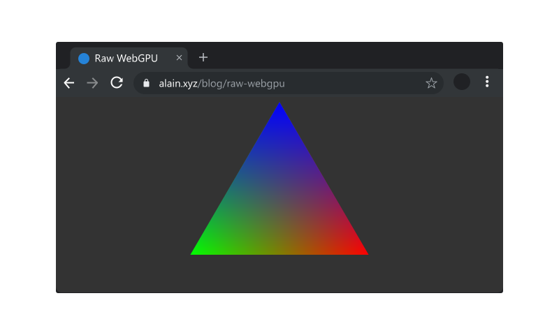

为了访问 WebGPU API，你需要检查全局变量`navigator`对象中是否存在一个`gpu`对象。

```typescript
// 🏭  WebGPU 入口
const entry: GPU = navigator.gpu;
if (!entry) {
    throw new Error('WebGPU is not supported on this browser.');
}
```

### 适配器

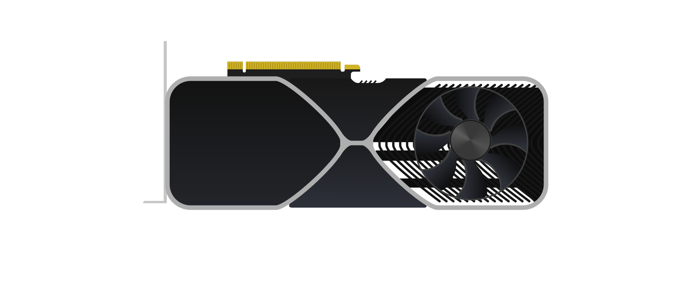

__适配器__ 描述了特定 GPU 的物理属性，例如它的名称、扩展和设备限制。

```typescript
// ✋ 定义适配器句柄 
let adapter: GPUAdapter = null;

// 🙏 内置的异步获取...

// 🔌 物理设备适配器 
adapter = await entry.requestAdapter();
```


### 设备

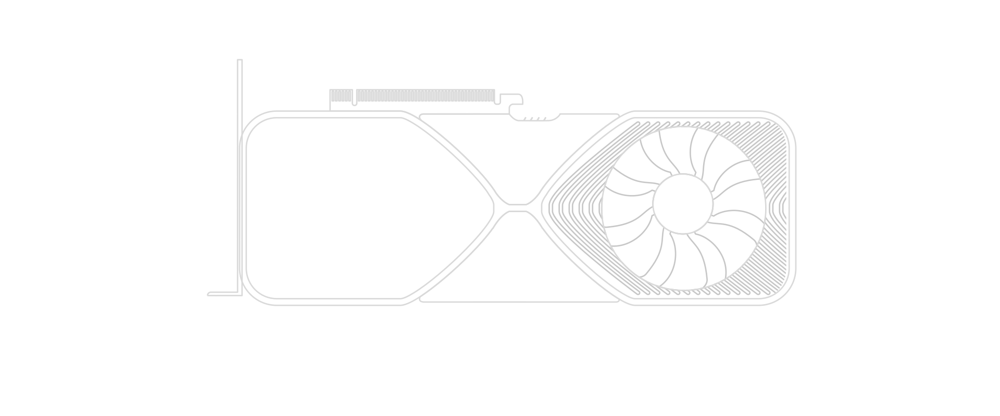

__设备__  是您访问 WebGPU API 的核心方式，它将允许您创建所需的数据结构。

```typescript
// ✋ 定义设备句柄 
let device: GPUDevice = null;

// 🙏 内置的异步获取...

// 💻 逻辑设备 
device = await adapter.requestDevice();
```


### 队列

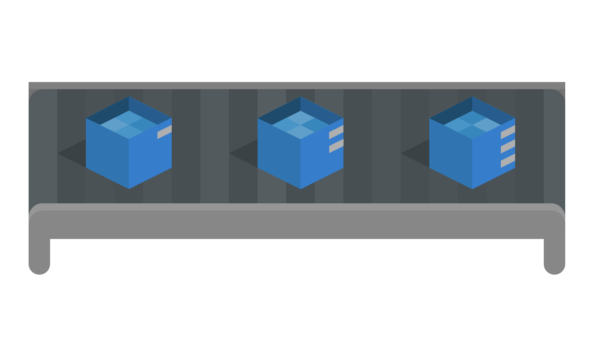

__队列__ 允许您将工作异步的发送到 GPU。在原文撰写时，您只能从给定的 `GPUDevice` 访问一个默认的队列。

```typescript
// ✋ 定义队列句柄 
let queue: GPUQueue = null;

// 📦 获取队列
queue = device.queue;
```


## 帧支持

### Canvas 上下文

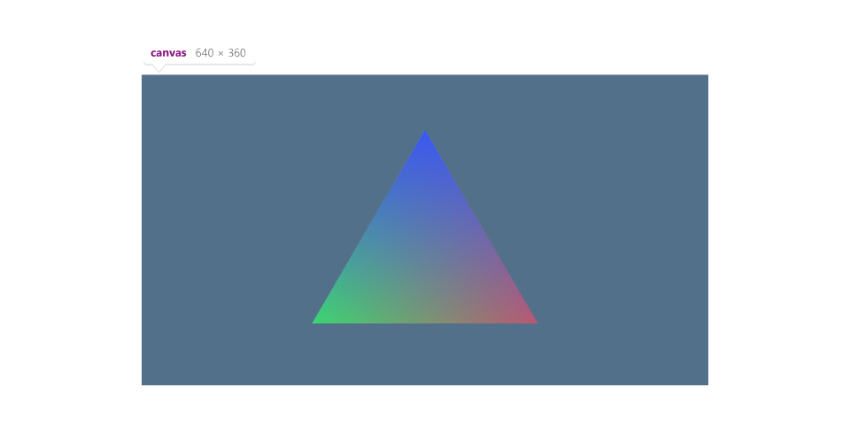

为了看到你所绘制的内容，您需要一个 `HTMLCanvasElement`  [canvas]/[画布] 元素， 并且需要从该画布获得一个 __Canvas 上下文__， Canvas 上下文管理一系列纹理，您将使用这些纹理来呈现最终的渲染输出到你的 canvas 元素。

```typescript
// ✋ 定义上下文句柄 
const context: GPUCanvasContext = null;

// ⚪ 创建上下文
context = canvas.getContext('webgpu');

// ⛓️ 配置上下文 
const canvasConfig: GPUCanvasConfiguration = {
    device: this.device,
    format: 'bgra8unorm',
    usage: GPUTextureUsage.RENDER_ATTACHMENT | GPUTextureUsage.COPY_SRC,
    alphaMode: 'opaque'
};

context.configure(canvasConfig);
```

### 帧缓冲附件

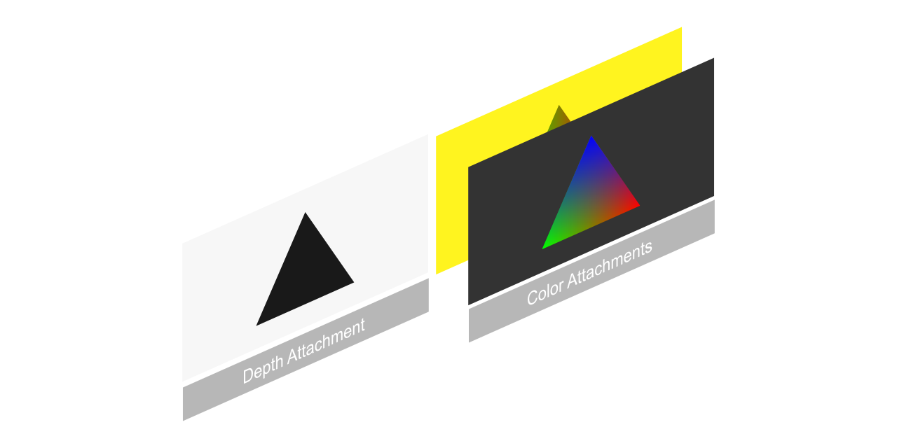

```typescript
// ✋ 定义附件句柄 
let depthTexture: GPUTexture = null;
let depthTextureView: GPUTextureView = null;

// 🤔 创建深度支持 
const depthTextureDesc: GPUTextureDescriptor = {
    size: [canvas.width, canvas.height, 1],
    dimension: '2d',
    format: 'depth24plus-stencil8',
    usage: GPUTextureUsage.RENDER_ATTACHMENT | GPUTextureUsage.COPY_SRC
};

depthTexture = device.createTexture(depthTextureDesc);
depthTextureView = depthTexture.createView();

// ✋ 定义 Canvas 上下文图像句柄 
let colorTexture: GPUTexture = null;
let colorTextureView: GPUTextureView = null;

colorTexture = context.getCurrentTexture();
colorTextureView = colorTexture.createView();
```

## 初始化资源

### 顶点和索引缓冲区

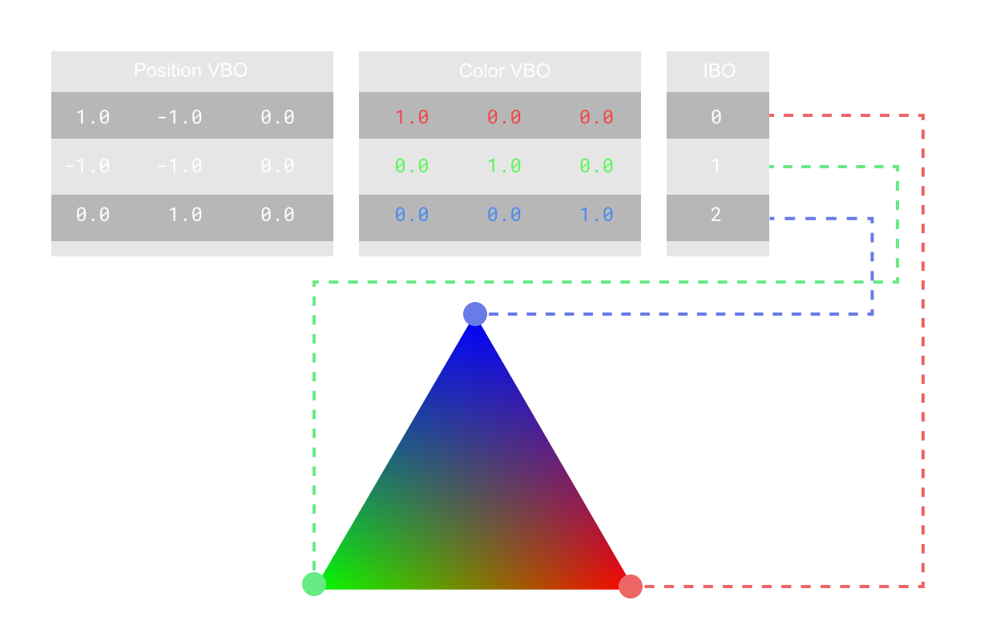

__[缓冲区]^(Buffer)__ 是一个数组数据，比如网格的位置数据、颜色数据、索引数据等。在只用基于光栅的图形管线渲染三角形的时候，你需要将一个或者多个顶点数据缓冲区「通常称为[顶点缓冲对象]^(VBO)」，以及一个包含与要绘制的每个三角形顶点相对应的索引的缓冲区「也称为[索引缓冲对象]^(IBO)」

```typescript
// 📈 位置顶点缓冲数据 
const positions = new Float32Array([
    1.0, -1.0, 0.0, -1.0, -1.0, 0.0, 0.0, 1.0, 0.0
]);

// 🎨 颜色顶点缓冲数据 
const colors = new Float32Array([
    1.0,
    0.0,
    0.0, // 🔴
    0.0,
    1.0,
    0.0, // 🟢
    0.0,
    0.0,
    1.0 // 🔵
]);

// 📇 索引缓冲数据 
const indices = new Uint16Array([0, 1, 2]);

// ✋ 定义缓冲区句柄 
let positionBuffer: GPUBuffer = null;
let colorBuffer: GPUBuffer = null;
let indexBuffer: GPUBuffer = null;

// 👋 辅助函数便于其他类型数组转化为 GPUBuffer(s) 
const createBuffer = (arr: Float32Array | Uint16Array, usage: number) => {
    // 📏 对齐到 4 字节 (感谢 @chrimsonite)
    let desc = {
        size: (arr.byteLength + 3) & ~3,
        usage,
        mappedAtCreation: true
    };
    let buffer = device.createBuffer(desc);

    const writeArray =
        arr instanceof Uint16Array
            ? new Uint16Array(buffer.getMappedRange())
            : new Float32Array(buffer.getMappedRange());
    writeArray.set(arr);
    buffer.unmap();
    return buffer;
};

positionBuffer = createBuffer(positions, GPUBufferUsage.VERTEX);
colorBuffer = createBuffer(colors, GPUBufferUsage.VERTEX);
indexBuffer = createBuffer(indices, GPUBufferUsage.INDEX);
```

### 着色器

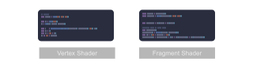

伴随着 WebGPU 来的还有一个新的着色器语言： [WebGPU Shading Language]^(WGSL)。

WebGPU 着色器语言类似于其他语言，如 Rust 、 Metal 着色器语言和 DirectX 高级着色器语言，具有 JavaScript 风格的装饰器， 例如 `@location(0)`， 采用 [蛇形命名法]^(snake_case) 的
[函数]/[成员]，
[驼峰命名法]^(CamelCase)的结构体，以及函数遵循 `fn my_func() -> i32` 的 Rust 代码格式。

以下是顶点着色器的源代码：

```wgsl
struct VSOut {
    @builtin(position) nds_position: vec4<f32>,
    @location(0) color: vec3<f32>,
};

@vertex
fn main(@location(0) in_pos: vec3<f32>,
        @location(1) in_color: vec3<f32>) -> VSOut {
    var vs_out: VSOut;
    vs_out.nds_position = vec4<f32>(in_pos, 1.0);
    vs_out.color = inColor;
    return vsOut;
}
```

以下是片段着色器的源代码：

```wgsl
@fragment
fn main(@location(0) in_color: vec3<f32>) -> @location(0) vec4<f32> {
    return vec4<f32>(in_color, 1.0);
}
```

> 使用像 [Mozilla Naga](https://github.com/gfx-rs/naga) 或者 [Google Tint](https://dawn.googlesource.com/tint/) 这样的转换器可以将其他着色器语（例如 HLSL 或 GLSL）转换为 WGSL，但是这个过程有点复杂。


### 着色器模块


__着色器模块__ 是一种普通的文本 WGSL 文件， 在 GPU 上使用给定的图形管道执行。

```typescript
// 📄 引入或者在行内定义您的WGSL代码:
import vertShaderCode from './shaders/triangle.vert.wgsl';
import fragShaderCode from './shaders/triangle.frag.wgsl';

// ✋ 定义着色器模块句柄 
let vertModule: GPUShaderModule = null;
let fragModule: GPUShaderModule = null;

const vsmDesc = { code: vertShaderCode };
vertModule = device.createShaderModule(vsmDesc);

const fsmDesc = { code: fragShaderCode };
fragModule = device.createShaderModule(fsmDesc);
```


### Uniform 缓冲区

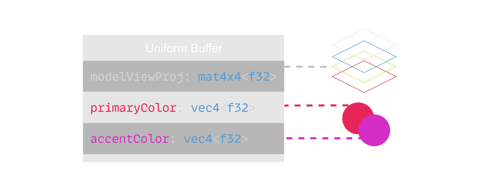

您通常需要直接向着色器模块提供数据，并且为此需要指定一个统一变量。要在着色器中创建 Uniform 缓冲区，请在主函数之前声明以下内容：

```wgsl
struct UBO {
  modelViewProj: mat4x4<f32>,
  primaryColor: vec4<f32>,
  accentColor: vec4<f32>
};

@group(0) @binding(0)
var<uniform> uniforms: UBO;

// ❗在您的顶点着色器的主文件中 ，
// 将倒数第四行替换为：
vsOut.Position = uniforms.modelViewProj * vec4<f32>(inPos, 1.0);
```

在您的 JavaScript 代码中，创建一个 Uniform 缓冲区，就像使用[索引]/[顶点]缓冲区一样。

> 为了更好地管理线性代数计算（例如矩阵乘法），您可能需要使用像 [gl-Matrix](https://github.com/toji/gl-matrix) 这样的库。

```typescript
// 👔 uniform数据 
const uniformData = new Float32Array([

    // ♟️ 模型视图投影矩阵 (单位矩阵)
    1.0, 0.0, 0.0, 0.0
    0.0, 1.0, 0.0, 0.0
    0.0, 0.0, 1.0, 0.0
    0.0, 0.0, 0.0, 1.0

    // 🔴 主颜色 
    0.9, 0.1, 0.3, 1.0

    // 🟣 强调色 
    0.8, 0.2, 0.8, 1.0
]);

// ✋ 定义缓冲区句柄 
let uniformBuffer: GPUBuffer = null;

uniformBuffer = createBuffer(uniformData, GPUBufferUsage.UNIFORM | GPUBufferUsage.COPY_DST);
```

### 管线布局 


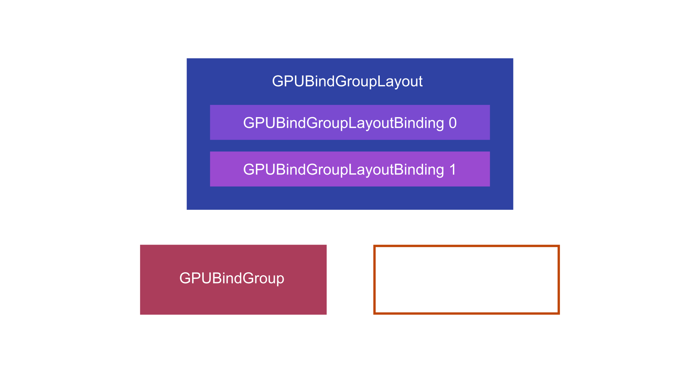


> 译者注： __管线布局__  本质上是一个着色器阶段的资源绑定布局描述，它定义了着色器需要的资源如何被绑定到管线上。它在创建渲染管线时被指定，确保着色器能够正确地访问所需的资源。

一旦您有了一个统一的 uniform ，您就可以创建一个 __管线布局__ 来描述在执行图形管线时该 uniform 的位置。

```typescript
let bindGroupLayout: GPUBindGroupLayout = null;
let uniformBindGroup: GPUBindGroup = null;

// 👨‍🔧 创建您的图形管线...

// 🧙‍♂️ 获取您的隐式管线布局:
bindGroupLayout = pipeline.getBindGroupLayout(0);

// 🗄️ 绑定组 
// ✍ 这将用于 *编码指令*
uniformBindGroup = device.createBindGroup({
    layout: bindGroupLayout,
    entries: [
        {
            binding: 0,
            resource: {
                buffer: uniformBuffer
            }
        }
    ]
});
```

或者您事先知道你的布局， 你可以自己在管线创建的时候创建并使用它。

```typescript
// ✋ 定义句柄 
let uniformBindGroupLayout: GPUBindGroupLayout = null;
let uniformBindGroup: GPUBindGroup = null;
let layout: GPUPipelineLayout = null;

// 📁 绑定组layout 
uniformBindGroupLayout = device.createBindGroupLayout({
    entries: [
        {
            binding: 0,
            visibility: GPUShaderStage.VERTEX,
            buffer: {}
        }
    ]
});

// 🗄️ 绑定组 
// ✍ 这将用于 *编码指令*
uniformBindGroup = device.createBindGroup({
    layout: uniformBindGroupLayout,
    entries: [
        {
            binding: 0,
            resource: {
                buffer: uniformBuffer
            }
        }
    ]
});

// 🗂️ Pipeline Layout
// 👩‍🔧 这将用作 GPUPipelineDescriptor 的成员，在创建管线的时候使用 
const pipelineLayoutDesc = { bindGroupLayouts: [uniformBindGroupLayout] };
layout = device.createPipelineLayout(pipelineLayoutDesc);

```

当进行指令编码的时候，您可以使用 `setBindGroup`：

```typescript
// ✍  在您指令编码后:
passEncoder.setBindGroup(0, uniformBindGroup);
```

### 图形管线


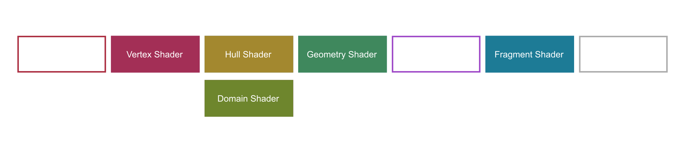


__图形管线__ 描述了所有要输入到光栅绘图管线执行中的数据。包括以下：

- 🔣 __输入组件__ - 每个顶点是什么样子？哪些属性在哪里，以及他们在内存中是如何对齐的？ 
- 🖍️ __着色器模块__ - 在执行此图形管线的时候，您将使用哪些着色器模块？
- ✏️ __Depth/Stencil State__ - 您应该执行深度测试吗？如果是这样，您应该使用什么函数来测试深度？
- 🍥 __混合状态__ - 在先前的颜色和当前的颜色之间应该如何混合颜色？ 
- 🔺 __光栅化__ - 在执行图形管线时，光纤化器的行为是如何的？它是否剔除面？应该剔除哪个方向的面？
- 💾 __Uniform 数据__ - 您的着色器应该需要什么样格式的统一数据？在 WebGPU 中，这是通过描述管道布局来实现的。 

WebGPU 为图形管线状态提供了只能默认设置，所以大多数时候您甚至不需要设置它，下面是一部分：

```typescript
// ✋ Declare pipeline handle
let pipeline: GPURenderPipeline = null;

// ⚗️ Graphics Pipeline

// 🔣 Input Assembly
const positionAttribDesc: GPUVertexAttribute = {
    shaderLocation: 0, // @location(0)
    offset: 0,
    format: 'float32x3'
};
const colorAttribDesc: GPUVertexAttribute = {
    shaderLocation: 1, // @location(1)
    offset: 0,
    format: 'float32x3'
};
const positionBufferDesc: GPUVertexBufferLayout = {
    attributes: [positionAttribDesc],
    arrayStride: 4 * 3, // sizeof(float) * 3
    stepMode: 'vertex'
};
const colorBufferDesc: GPUVertexBufferLayout = {
    attributes: [colorAttribDesc],
    arrayStride: 4 * 3, // sizeof(float) * 3
    stepMode: 'vertex'
};

// 🌑 Depth
const depthStencil: GPUDepthStencilState = {
    depthWriteEnabled: true,
    depthCompare: 'less',
    format: 'depth24plus-stencil8'
};

// 🦄 Uniform Data
const pipelineLayoutDesc = { bindGroupLayouts: [] };
const layout = device.createPipelineLayout(pipelineLayoutDesc);

// 🎭 Shader Stages
const vertex: GPUVertexState = {
    module: vertModule,
    entryPoint: 'main',
    buffers: [positionBufferDesc, colorBufferDesc]
};

// 🌀 Color/Blend State
const colorState: GPUColorTargetState = {
    format: 'bgra8unorm'
};

const fragment: GPUFragmentState = {
    module: fragModule,
    entryPoint: 'main',
    targets: [colorState]
};

// 🟨 Rasterization
const primitive: GPUPrimitiveState = {
    frontFace: 'cw',
    cullMode: 'none',
    topology: 'triangle-list'
};

const pipelineDesc: GPURenderPipelineDescriptor = {
    layout,
    vertex,
    fragment,
    primitive,
    depthStencil
};

pipeline = device.createRenderPipeline(pipelineDesc);
```


### 指令编码器


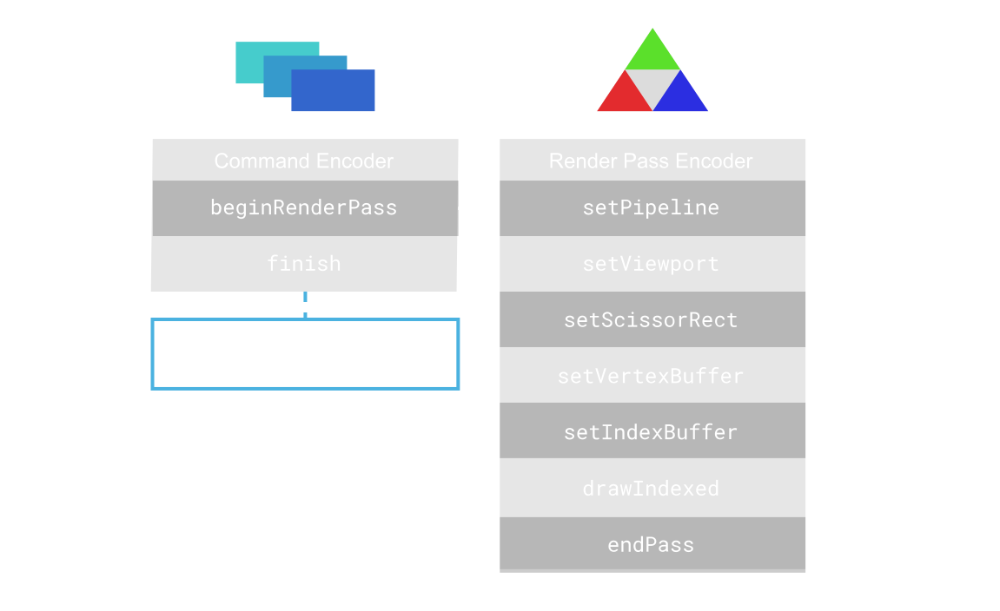


__指令编码器__ 会将您打算在 __渲染通道编码器__ 组中执行的所有的绘制指令进行编码。一旦完成了指令的编码，您将收到一个指令缓冲区，可以将其提交到队列中。

这个意义在于指令缓冲区类似于在 GPU 提交到队列后执行绘图函数的 _回调_。

```typescript
// ✋ Declare command handles
let commandEncoder: GPUCommandEncoder = null;
let passEncoder: GPURenderPassEncoder = null;

// ✍️ Write commands to send to the GPU
const encodeCommands = () => {
    let colorAttachment: GPURenderPassColorAttachment = {
        view: this.colorTextureView,
        clearValue: { r: 0, g: 0, b: 0, a: 1 },
        loadOp: 'clear',
        storeOp: 'store'
    };

    const depthAttachment: GPURenderPassDepthStencilAttachment = {
        view: this.depthTextureView,
        depthClearValue: 1,
        depthLoadOp: 'clear',
        depthStoreOp: 'store',
        stencilClearValue: 0,
        stencilLoadOp: 'clear',
        stencilStoreOp: 'store'
    };

    const renderPassDesc: GPURenderPassDescriptor = {
        colorAttachments: [colorAttachment],
        depthStencilAttachment: depthAttachment
    };

    commandEncoder = device.createCommandEncoder();

    // 🖌️ Encode drawing commands
    passEncoder = commandEncoder.beginRenderPass(renderPassDesc);
    passEncoder.setPipeline(pipeline);
    passEncoder.setViewport(0, 0, canvas.width, canvas.height, 0, 1);
    passEncoder.setScissorRect(0, 0, canvas.width, canvas.height);
    passEncoder.setVertexBuffer(0, positionBuffer);
    passEncoder.setVertexBuffer(1, colorBuffer);
    passEncoder.setIndexBuffer(indexBuffer, 'uint16');
    passEncoder.drawIndexed(3);
    passEncoder.endPass();

    queue.submit([commandEncoder.finish()]);
};
```

## 渲染





__渲染__ 是在 WebGPU 中简单地更新任务你打算更新的 uniform， 从你的上下文或者下一个附件，提交你的指令编码器以执行，然后使用 `requestAnimationFrame`  回调再次执行所有这些操作。

```typescript
const render = () => {
    // ⏭ Acquire next image from context
    colorTexture = context.getCurrentTexture();
    colorTextureView = colorTexture.createView();

    // 📦 Write and submit commands to queue
    encodeCommands();

    // ➿ Refresh canvas
    requestAnimationFrame(render);
};
```


## 结束语

__WebGPU__ 可能比其他图形 API 更难，但是它的API _设计的与现在显卡相结合的更紧密_，因此，不仅可以让应用程序更快，并且更长效。

有些事情作者没有在这篇文章中涉及，因为它们超出了这篇文章的范围，比如：

- __矩阵__ 不管是用于视角还是场景中的物体转换。 gl-Matrix 是一种无价的资源。
- [WebGPU 类型定义]() 详细概述了绘图管线的每种可能状态，是非常有帮助的。
- __混合模式__ [Anders Riggelsen 在这里编写了一个工具](https://www.andersriggelsen.dk/glblendfunc.php)，可以帮助您以可视化的方式查看 OpenGL 混合模式的行为。
- __计算管线__ 如果您想尝试的化，请查看下面的说明或者一些示例。
- __加载纹理__ 这可能有点复杂，下面的示例很好的介绍了如何加载纹理。


### 其他资源

下面是一些关于 WebGPU 的[文章]/[项目]，顺序不分先后：

- William Usher ([@_wusher](https://twitter.com/_wusher))'s article, updated for the Chrome 113 release of WebGPU: [From 0 to glTF with WebGPU](https://www.willusher.io/graphics/2023/04/10/0-to-gltf-triangle).
- [Dzmitry Malyshau](https://github.com/kvark) wrote an article similar to this one [introducing WebGPU in Mozilla FireFox](https://hacks.mozilla.org/2020/04/experimental-webgpu-in-firefox/).
- [Warren Moore](https://metalbyexample.com/) ([@warrenm](https://twitter.com/warrenm)) wrote an article to help folks transition from the Metal API to [WebGPU](https://metalbyexample.com/webgpu-part-one/).
- [Brandon Jones](https://blog.tojicode.com/) ([@Tojiro](https://twitter.com/Tojiro)) wrote an article describing how to write a [GLTF renderer in WebGPU](https://toji.github.io/webgpu-gltf-case-study/).
- [Learn WGPU](https://sotrh.github.io/learn-wgpu/#what-is-wgpu) is an introduction to writing WebGPU applications with Rust.
- [Learn WebGPU](https://eliemichel.github.io/LearnWebGPU/) for native graphics in C++.

这有许多开源项目：

- [Austin Eng](http://austineng.github.io/)'s [WebGPU Samples](http://austin-eng.com/webgpu-samples/samples/texturedCube)
- [Tarek Sherif](http://tareksherif.net/) ([@tsherif](https://twitter.com/thsherif))'s [WebGPU Examples](https://github.com/tsherif/webgpu-examples)
- [RedGPU](https://github.com/redcamel/RedGPU) by [@RedCamel15](https://twitter.com/redcamel15), a series of examples written for WebGPU.
- [Three.js' WebGPU Source](https://github.com/mrdoob/three.js/tree/dev/examples/jsm/renderers/webgpu)
- [BabylonJS's WebGPU Source](https://github.com/BabylonJS/Babylon.js/blob/WebGPU/src/Engines/webgpuEngine.ts)
- [WebGPU's Type Definitions](https://github.com/gpuweb/types)
- [WebGPU's Conformance Tests](https://github.com/gpuweb/cts)
- [Dawn - A C++ Implementation of WebGPU](https://dawn.googlesource.com/dawn) used to power Chromium's implementation of WebGPU. Carl Woffenden released a [Hello Triangle example with WebGPU and Dawn](https://github.com/cwoffenden/hello-webgpu).
- [wgpu-native](https://github.com/gfx-rs/wgpu-native) is a native WebGPU implementation in Rust, which can easily be used in all sorts of native projects.

 WebGPU 和 WebGPU 着色器语言的规范也值得看一看：

- [WebGPU Specification](https://gpuweb.github.io/gpuweb/)
- [WebGPU Shading Language (WGSL) Specification](https://gpuweb.github.io/gpuweb/wgsl/)
